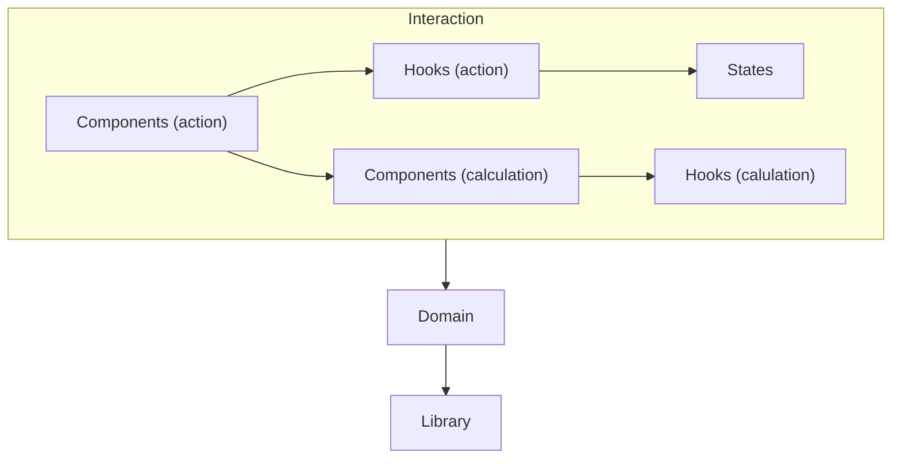

# React with Onion Architecture

이 프로젝트는 [<쏙쏙 들어오는 함수형 코딩>(에릭 노먼드, 제이펍, 2022)](http://www.yes24.com/Product/Goods/108748841)에서 제안하는 함수형 코딩 기법과 어니언 아키텍처를, 리액트를 이용한 웹 서비스에서 적용해보기 위해 작성한 샘플 코드입니다.

## 함수형 코딩

<쏙쏙 들어오는 함수형 코딩>의 저자인 에릭 노먼드가 제안하는 함수형 코딩의 기본 개념은 '액션'에서 '계산'을 추출하는 것입니다. '계산'이란 암묵적인 입력과 출력이 없는 함수, 다르게 말하면 전역변수를 사용하지 않고 부수효과가 없는 순수함수를 의미합니다. 따라서 '계산'은 테스트가 용이하고 재사용성이 좋지만 '계산'이 아닌 '액션'은 그렇지 않습니다. '액션'은 최소한으로 유지될 수 있도록 해야 하며, 버그가 발생되지 않도록 관리되어야 합니다.

## 계층형 구조

코드의 가독성을 떨어뜨리는 원인 중 하나는 함수가 서로 다른 추상화 수준의 코드 또는 함수로 작성되기 때문입니다. 따라서 함수를 추상화 수준에 따라 계층을 나누어 함수를 구성하는 함수는 구성되는 함수보다 아래의 계층이 되도록 해야 합니다. (같은 계층의 함수를 호출해서도 안됩니다.) 높은 계층에 속한 함수일수록 더 추상적인 수준의 코드/함수로 작성되고, 더 구체적인 상황에서 사용됩니다. 이렇게 코드를 계층형 구조가 되도록 작성하면, 액션은 상위의 계층에 계산은 하위의 계층에 속하게 됩니다.

## 어니언 아키텍처

에릭 노먼드가 제안하는 가장 단순한 어니언 아케텍처는 '인터랙션', '도메인', '언어'의 세 계층으로 이루어진 '계층형 구조'입니다. 도메인 계층은 비즈니스 로직을 정의하는 계산으로 이루어져 있고, 언어 계층은 비즈니스 로직을 구현하기 위한 계산들로 이루어져 있습니다. 그리고 인터랙션 계층은 현실 세계와 도메인 간의 상호 작용이 적용되어 있는 계층으로, 액션으로 이루어져 있습니다. 이 계층들은 내부적으로 각각 계층형 구조를 이루지만, 도메인 계층에서는 언어 계층의 최상위 계층에만 접근가능하며, 인터랙션 계층은 도메인 계층의 최상위 계층에만 접근 가능합니다. 이렇게 상위의 계층에서 접근가능한 하위 계층의 최상위 계층을, 에릭 노먼드는, '인터페이스' 또는 '추상화 벽'이라고 부릅니다. 상위 계층에서는 하위 계층의 인터페이스에 속하는 함수들만 사용할 수 있는데, 하위 계층의 모든 함수를 알아야 하는 부담을 줄일 수 있기 때문입니다.

## 리액트 함수 컴포넌트

JSX는 javascript 객체이기 때문에 데이터라고 볼 수 있습니다. (참고: [https://ko.reactjs.org/docs/introducing-jsx.html](https://ko.reactjs.org/docs/introducing-jsx.html)) 그래서 내부 상태가 없는 리액트 컴포넌틑는 ‘계산'이라고 말할 수 있습니다.

그렇다면 내부 상태가 있는 컴포넌트는 어떨까요? `useState`는 액션일까요 계산일까요? 실행할 때마다 다른 값을 출력한다는 의미에서 그것은 액션입니다. 게다가 `useState`의 출력 중 하나인 `setState()`는 어떤 전역 변수를 수정하는 것이 틀림없기 때문에 액션이다.(그것은 새 state를 받아 컴포넌트 리렌더링을 큐에 등록합니다.) 액션이 포함된 코드 역시 액션이기 때문에 `useState`를 사용하는 함수 컴포넌트는 액션이 틀림없어 보입니다.

하지만 <쏙쏙 들어오는 함수형 코딩> 314쪽에 나오는 아래의 코드를 살펴보면 다르게 생각할 수 있습니다.

```javascript
function map(array, f) {
	return reduce(array , [], function(ret, item) {
		ret.push(f(item));
		return ret :
	}
}
```

`reduce`의 인자로 들어가는 익명 함수는 외부 데이터인 `ret`을 변형시키기 때문에 액션입니다. 하지만 저자는 "변이가 지역적으로 일어나기 때문에 여전히 계산이라는 규칙을 유지합니다.”(314)라고 말합니다. 액션이 포함된 코드라도 변이가 지역적으로만 일어난다면 그 코드는 계산이라고 볼 수 있는 것입니다. `useState`가 포함된 코드를 작성할 때, 우리는 위의 코드에서 익명함수 내부의 코드를 작성하는 것과 유사하다고 볼 수 있고, 변이가 외부로 전파되지만 않는다면, 우리는 액션을 작성했다고 말할 수 없습니다. 따라서 Context API나 `Recoil` 등의 전역 상태 관리자만 사용하지 않는다면, `useState` 등의 hook을 사용하더라도 그 컴포넌트는 계산이라고 말할 수 있습니다.

## 인터랙션

그래서 아래의 다이어그램과 같이 인터랙션 계층에 액션 뿐만 아니라 계산도 포함될 수 있을 것입니다. Hook은 전역 상태가 사용하거나 외부 API를 사용하는 액션과 그렇지 않은 계산으로 나뉠 수 있고, 액션인 Hook을 사용하는 컴포넌트가 액션, 계산인 Hook을 사용하는 컴포넌트는 계산으로 간주할 수 있습니다.



## 디렉토리 구조

```
├─ interaction
│  └─ layer
│     └─ ...
│        ├─ hooks
│        │  └─ layer
│        │     └─ ...
│        │        └─ states
│        │
│        └─ components
│           └─ layer
│              └─ ...
│                 └─ hooks
│                    └─ layer
│	  					          └─ ...
│
├─ domain
│  └─ layer
│     └─ ...
│
└─ library
   └─ layer
      └─ layer
         └─ ...
```

`library`, `domain`, `interaction`은 각각 어니언 아키첵처에서의 언어 계층, 도메인 계층, 인터랙션 계층에 해당하는 디렉토리입니다. 언어 계층, 도메인 계층, 인터랙션 계층은 디렉토리 상으로는 같은 계층에 속해 있지만, `interaction`이 가장 상위의 계층으로 `library`가 가장 하위의 계층으로 이해해야 합니다. `library`, `domain`, `interaction` 각 디렉토리의 내부에서는, 계층의 위계 구조가 명확히 드러나도록, 개념상의 계층과 디렉토리 구소 상의 계층이 일치하도록 서브 디렉토리를 만들어 하위 계층을 구현했습니다. (그리고 네이밍의 어려움을 피하기 위해 특별한 경우가 아니라면, 그 서브 디렉토리 이름을 `layer`로 정했습니다.)

따라서 언어 계층의 인터페이스에 속하는 함수들은 `library` 디렉토리에 있는 파일에 작성된 함수들을 의미하게 되고, 도메인 계층의 인터페이스는 `domain`의 서브 디렉토리가 아닌 곳에서 작성된 함수들을 의미하게 됩니다.

`components`에는 리액트 컴포넌트 중 전역 상태나 외부 API를 사용하지 않은 컴포넌트가 정의되어 있습니다. 따라서 그 하위의 `hooks`에도 전역 상태나 외부 API 접근에 대한 hook이 포함되어서는 안됩니다. 전역 상태가 정의되어 있는 곳은 `states`으로 그 상위의 디렉토리에 정의된 hook들은 전역 상태에 관한 것이거나 외부 API를 사용하는 hook입니다.
