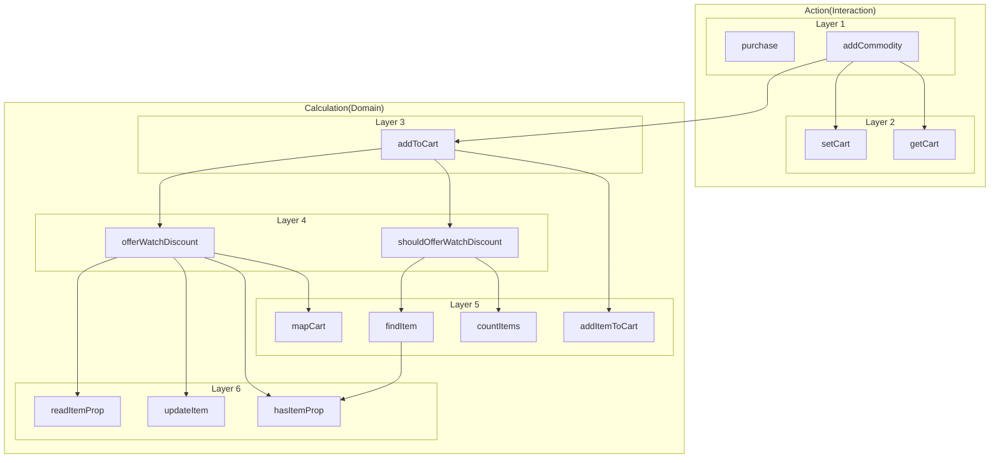
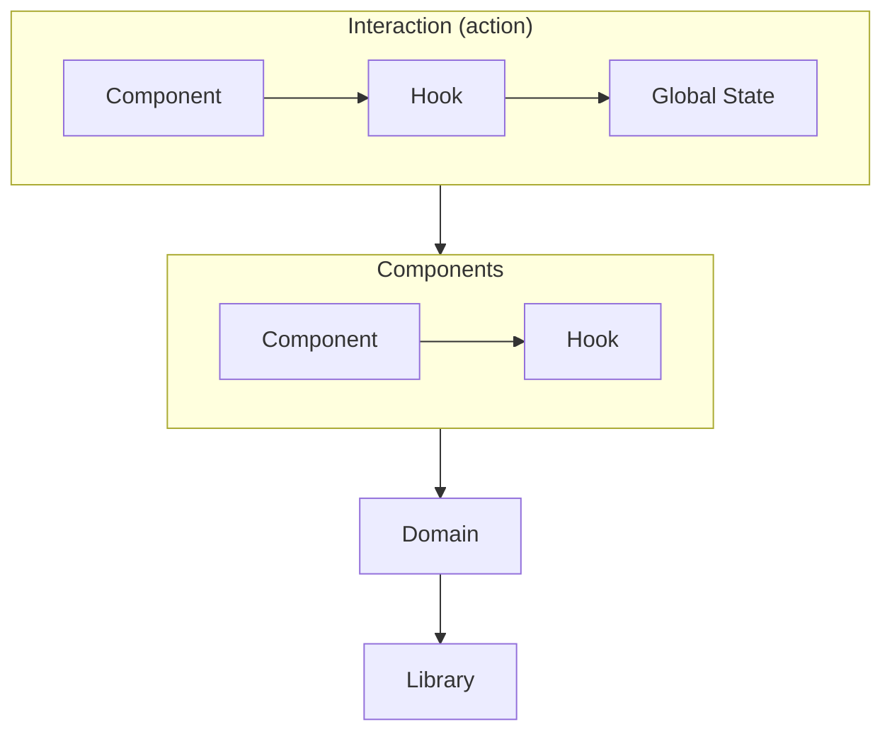

# 어니언 아키텍처 제안

## 계층형 구조



## 어니언 아키텍처 적용



## 어니언 아키텍처 적용: 파일 구조

```
📦roa
┣ 📂components
┃ ┣ 📜Commodity.tsx
┃ ┗ 📜index.ts
┣ 📂domain
┃ ┣ 📂layer
┃ ┃ ┗ 📜cart.ts
┃ ┣ 📜cart.ts
┃ ┗ 📜index.ts
┣ 📂interaction
┃ ┣ 📂layer
┃ ┃ ┣ 📂layer
┃ ┃ ┃ ┗ 📜cartState.ts
┃ ┃ ┣ 📜useCart.tsx
┃ ┃ ┗ 📜usePurcase.tsx
┃ ┣ 📜PurchasePage.tsx
┃ ┗ 📜ShoppingPage.tsx
┗ 📂library
┃ ┣ 📂layer
┃ ┃ ┗ 📜item.ts
┃ ┣ 📜cart.ts
┃ ┗ 📜index.ts
```
