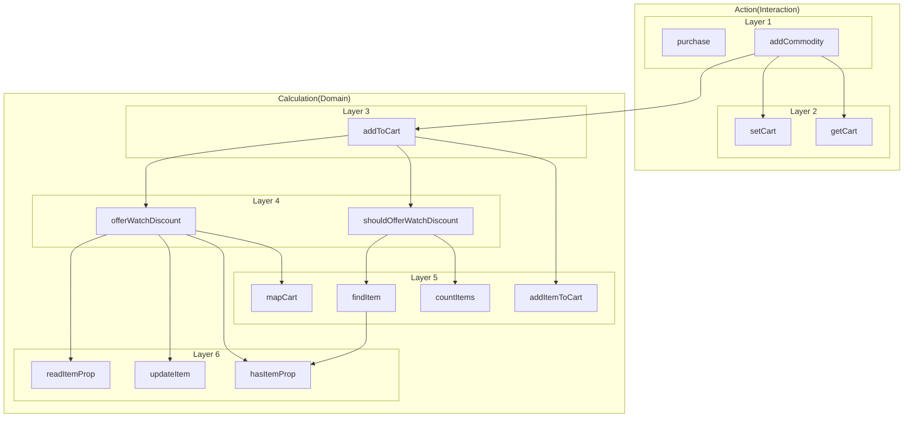
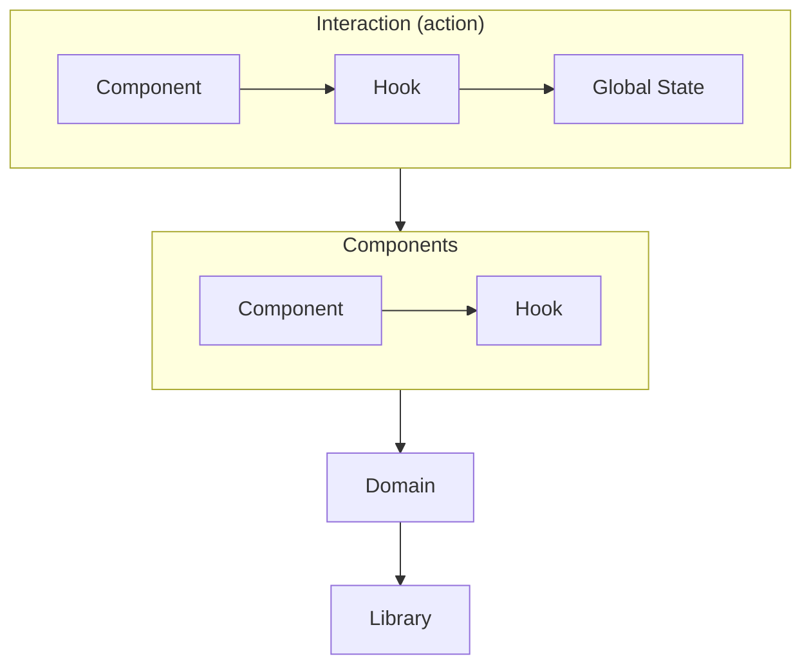

# 계층형 구조와 어니언 아키텍처

참고: [에릭 노먼드 <쏙쏙 들어오는 함수형 코딩>, 제이펍, 2022](http://www.yes24.com/Product/Goods/108748841)

## 함수형 프로그래밍

- 액션(비순수함수)을 최소화하고 계산(순수함수)을 최대화한다.
  - 계산은 액션에 비해 가독성, 유지보수, 테스트, 재사용 측면에서 유리하다.
- 데이터 구조가 아니라 기능을 중심으로 생각한다.
  - 높은 추상성을 가진 함수를 많이 작성하면, 세부 구현에 대한 고려가 줄어들어, 기능 구현에 대해서만 관심을 집중할 수 있다.
  - 데이터 구조가 변경되더라고 코드 변경을 최소화할 수 있다.

## 계층형 구조

함수를 계층으로 나누어 상위의 계층은 하위의 계층의 함수만을 호출한다.



### 가독성

- 가까운 하위 계층의 함수들을 호출한다면 비슷한 추상성을 가지는 코드들로 함수를 작성할 수 있어서 가독성이 좋아진다.
- 예를 들어, Layer 4 이상의 코드들은 장바구니의 데이터 구조에 대해 신경 쓰지 않아도 되기 때문에, 기능 구현에 집중해서 코드를 작성할 수 있다.

### 유지보수

- 하위 계층의 함수의 변경은 그보다 상위 계층의 함수들에게만 영향을 미친다.
- 상위 계층에 있는 함수일수록 다른 코드에 영향을 적게 주기 때문에 코드를 수정하기가 쉽다.
- 액션에서 계산을 많이 추출해서 하위 계층에 둔다면, 액션이 확대되는 것을 막을 수 있다.
- 인터페이스
  - 인터페이스 위와 아래의 코드의 의존성을 없앨 수 있다.
    - 상위 계층의 함수가 호출할 수 있는 하위 함수의 계층에 제한을 둘 수 있다.
    - 하위 계층의 변경이 영향을 주는 상위 계층의 영향 범위를 결정할 수 있다.
  - 예를 들어, 장바구니의 데이터 구조가 오브젝트로 변경되더라도 Layer 4 이상의 코드는 변경할 필요가 없다.

### 테스트

- 하위 계층의 함수일수록 전체 코드에 더 많은 영향을 주기 때문에 하위 계층의 함수를 테스트하는 것이 더 가치있다.
- 하위 계층의 함수일수록 쉽게 수정이 되지 않기 때문에 코드 수정에 따른 테스트 코드 추가 작성의 부담이 적다.

### 재사용

- 하위 계층의 함수일수록 재사용 빈도가 높아진다.

## 어니언 아키텍처

- 인터랙션
  - 전역 상태 입출력, 서버와의 통신 등 액션으로 구성된 계층들
- 도메인
  - 비즈니스 로직과 관련된 계산으로 이루어진 계층들

## 리액트 프로젝트에서의 어니언 아키텍처



### 아키텍처

- 인터랙션
  - 전역 상태 입출력과 서버와의 통신 등 담당하며 컴포넌트로 상태를 전달
  - 컨테이너
- 컴포넌트
  - 계산
  - 프리젠터, 폼
  - 전역 상태에 영향을 주지 않는 로컬 상태 포함
- 도메인
  - 비즈니스 로직
- 라이브러리
  - 비즈니스 로직과 관련된 기본 동작 정의

### 파일 구조

```
📦root
 ┣ 📂interaction
 ┃ ┣ 📂layer
 ┃ ┃ ┣ 📂layer
 ┃ ┃ ┃ ┗ 📜cartState.ts
 ┃ ┃ ┣ 📜useCart.tsx
 ┃ ┃ ┗ 📜usePurcase.tsx
 ┃ ┣ 📜PurchasePage.tsx
 ┃ ┗ 📜ShoppingPage.tsx
 ┣ 📂components
 ┃ ┣ 📂layer
 ┃ ┃ ┗ 📜Commodity.tsx
 ┃ ┗ 📜index.ts
 ┣ 📂domain
 ┃ ┣ 📂layer
 ┃ ┃ ┣ 📂layer
 ┃ ┃ ┃ ┗ 📜cart.ts
 ┃ ┃ ┗ 📜cart.ts
 ┃ ┗ 📜index.ts
 ┗ 📂library
 ┃ ┣ 📂cart
 ┃ ┃ ┣ 📂item
 ┃ ┃ ┃ ┗ 📜item.ts
 ┃ ┃ ┗ 📜cart.ts
 ┃ ┗ 📜index.ts
```

- 하나의 폴더는 하나의 계층. 동일한 폴더에 있다면 동일한 계층의 함수들
  - 계층에 대한 폴더 이름을 결정할 수 없을 때는 `layer`
  - interaction, components, domain, libraray은 예외. 동일한 폴더 내에 있지만 동일한 계층이 아님.
- 하위 폴더는 하위 계층
- `index.ts`: 인터페이스
- 폴더 구조가 너무 복잡하다거나 컨벤션을 지키키 어렵다면 모노 레포를 사용하는 것을 고려해볼 수 있음
