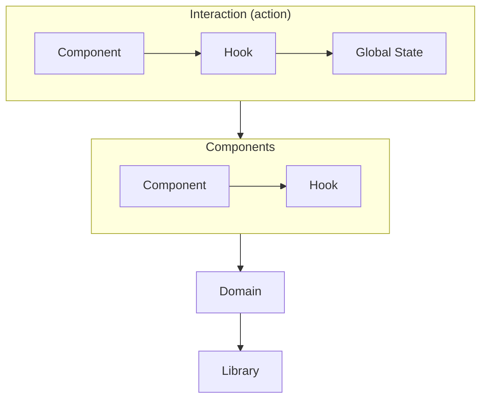

## 계층

```mermaid
flowchart TD
	subgraph I["Interaction (action)"]
		CA["Component"]
		CA --> HA["Hook"] --> S["Global State"]
	end
	subgraph C["Components"]
		CC["Component"] --> HC["Hook"]
	end
	I --> C
	C --> D["Domain"]
	D --> L["Library"]

```
